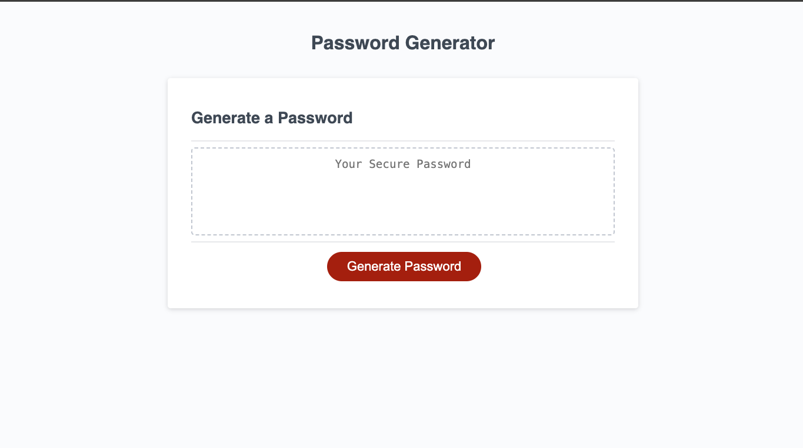

# Password-Generator

# Description
This application generates a random password for the user based on critiria they've selected. This app runs in the browser, and features dynamically updated HTML and CSS powered by JavaScript code. There is a clean and polished user interface that is responsive by adapting to multiple screen sizes. The password can include lowercase, uppercase, numeric, and/or special characters.

# Deployment
Click [here] (https://tsmit143.github.io/Password-Generator/)

# License
https://choosealicense.com/licenses/mit/

